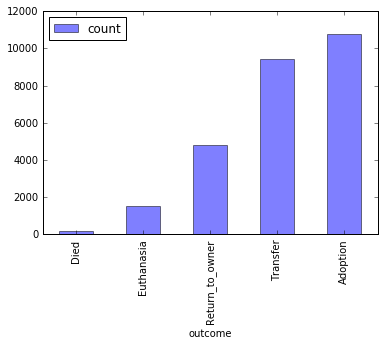
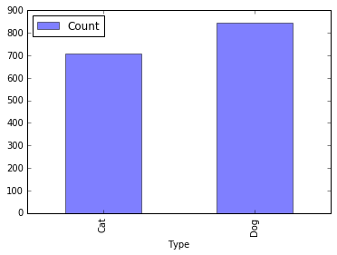
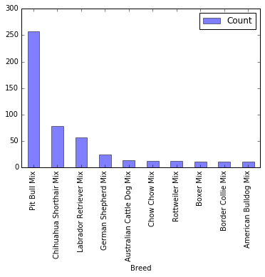
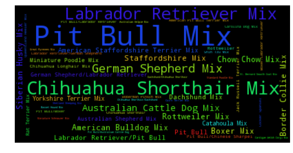
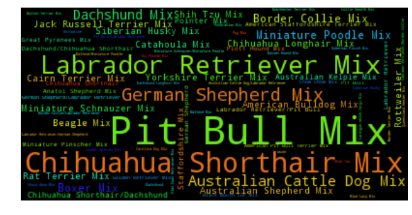
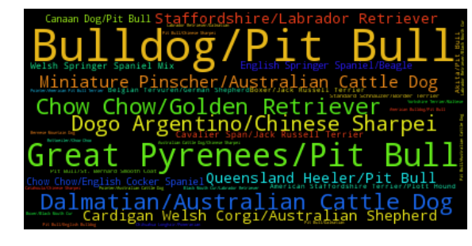
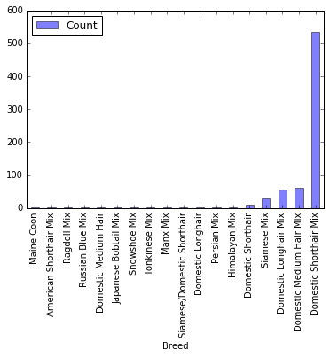
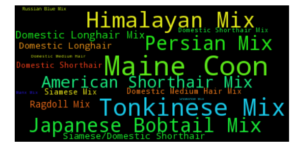
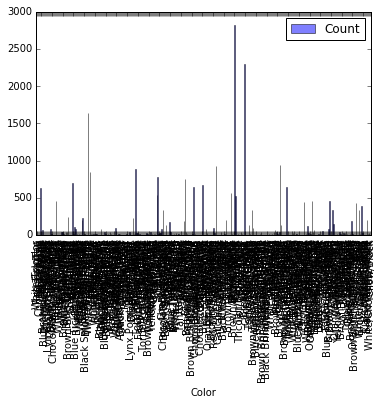

```python
# import statements
from pyspark.sql import SQLContext
from pyspark.sql import Row
import matplotlib.pyplot as plt
from wordcloud import WordCloud
%matplotlib inline
# Set up SQL Context
sqlContext = SQLContext(sc)
```

# Shelter Animal Outcomes
## Kaggle Competition

### Load Data


```python
data = (sc.textFile("train.csv")
          .map(lambda line: line.split(",")))
header = data.filter(lambda row: row[0] == "AnimalID").collect()[0]

rows = data.filter(lambda row: row[0] != "AnimalID")
rows.cache()

print ("Header:")
print (header)
print ("Rows:")
print (rows.take(5))
```

    Header:
    [u'AnimalID', u'Name', u'DateTime', u'OutcomeType', u'OutcomeSubtype', u'AnimalType', u'SexuponOutcome', u'AgeuponOutcome', u'Breed', u'Color']
    Rows:
    [[u'A671945', u'Hambone', u'2014-02-12 18:22:00', u'Return_to_owner', u'', u'Dog', u'Neutered Male', u'1 year', u'Shetland Sheepdog Mix', u'Brown/White'], [u'A656520', u'Emily', u'2013-10-13 12:44:00', u'Euthanasia', u'Suffering', u'Cat', u'Spayed Female', u'1 year', u'Domestic Shorthair Mix', u'Cream Tabby'], [u'A686464', u'Pearce', u'2015-01-31 12:28:00', u'Adoption', u'Foster', u'Dog', u'Neutered Male', u'2 years', u'Pit Bull Mix', u'Blue/White'], [u'A683430', u'', u'2014-07-11 19:09:00', u'Transfer', u'Partner', u'Cat', u'Intact Male', u'3 weeks', u'Domestic Shorthair Mix', u'Blue Cream'], [u'A667013', u'', u'2013-11-15 12:52:00', u'Transfer', u'Partner', u'Dog', u'Neutered Male', u'2 years', u'Lhasa Apso/Miniature Poodle', u'Tan']]


```python
df = rows.toDF(header).cache();
```


```python
df.show(5)
```

    +--------+-------+-------------------+---------------+--------------+----------+--------------+--------------+--------------------+-----------+
    |AnimalID|   Name|           DateTime|    OutcomeType|OutcomeSubtype|AnimalType|SexuponOutcome|AgeuponOutcome|               Breed|      Color|
    +--------+-------+-------------------+---------------+--------------+----------+--------------+--------------+--------------------+-----------+
    | A671945|Hambone|2014-02-12 18:22:00|Return_to_owner|              |       Dog| Neutered Male|        1 year|Shetland Sheepdog...|Brown/White|
    | A656520|  Emily|2013-10-13 12:44:00|     Euthanasia|     Suffering|       Cat| Spayed Female|        1 year|Domestic Shorthai...|Cream Tabby|
    | A686464| Pearce|2015-01-31 12:28:00|       Adoption|        Foster|       Dog| Neutered Male|       2 years|        Pit Bull Mix| Blue/White|
    | A683430|       |2014-07-11 19:09:00|       Transfer|       Partner|       Cat|   Intact Male|       3 weeks|Domestic Shorthai...| Blue Cream|
    | A667013|       |2013-11-15 12:52:00|       Transfer|       Partner|       Dog| Neutered Male|       2 years|Lhasa Apso/Miniat...|        Tan|
    +--------+-------+-------------------+---------------+--------------+----------+--------------+--------------+--------------------+-----------+
    only showing top 5 rows
    


```python
# get SQLContext & register df as Table
df.registerTempTable('Animals')
```

### Data Exploration
#### Reuseable Functions


```python
def wordcloud_from_frequencies(freq):
    wcFull = WordCloud(max_font_size=40, relative_scaling=.5)
    wcFull.generate_from_frequencies(freq)
    plt.figure(figsize=(10,8))
    plt.imshow(wcFull)
    plt.axis('off')
    plt.show()
    
def sql_to_pandas(sql_query):
    dataframe = sqlContext.sql(sql_query)
    return dataframe.toPandas()

def key_values_to_bar(kv_pairs):
    D = dict(kv_pairs)
    # below from http://stackoverflow.com/questions/16010869/python-plot-a-bar-using-matplotlib-using-a-dictionary
    plt.figure()
    plt.bar(range(len(D)), D.values(), align='center')
    plt.xticks(range(len(D)), list(D.keys()))
    plt.show()

```

#### Constant Values


```python
COUNT = df.count()
print "COUNT: " + str(COUNT)
OUTCOME = 3
ANIMAL_TYPE = 5
AGE = 7
BREED = 8
COLOUR = 9
```

    COUNT: 26729


### Outcome Frequency


```python
(sql_to_pandas("SELECT OutcomeType as outcome, count(*) as count " + 
               "FROM Animals GROUP BY OutcomeType ORDER BY count(*)")
                 .plot(x='outcome', y='count', kind='bar', alpha=0.5))
```


    <matplotlib.axes._subplots.AxesSubplot at 0x7fcadfabc250>





### Euthanised Count by Animal Type


```python
(sql_to_pandas("SELECT AnimalType as Type, count(*) as Count " + 
               "FROM Animals WHERE OutcomeType='Euthanasia' GROUP BY AnimalType ORDER BY count(*)")
                 .plot(x='Type', y='Count', kind='bar', alpha=0.5))
```


    <matplotlib.axes._subplots.AxesSubplot at 0x7fcadf4e79d0>





### Euthanised Count by Dog Breed


```python
(sql_to_pandas("SELECT Breed, count(*) as Count " + 
               "FROM Animals WHERE OutcomeType='Euthanasia' AND AnimalType='Dog' " + 
               "GROUP BY Breed ORDER BY count(*) DESC LIMIT 10")
                 .plot(x='Breed', y='Count', kind='bar', alpha=0.5))
```


    <matplotlib.axes._subplots.AxesSubplot at 0x7fcadc4a9510>





```python

freq = (rows
        .filter(lambda row: row[OUTCOME] == "Euthanasia" and row[ANIMAL_TYPE] == "Dog")
        .map(lambda row: (row[BREED], 1))
        .reduceByKey(lambda a,b: a + b)
        .map(lambda (k,v): (k,(float(v)/float(COUNT))))).collect()
wordcloud_from_frequencies(freq)
```





```python
freq = (rows
        .filter(lambda row: row[ANIMAL_TYPE] == "Dog")
        .map(lambda row: (row[BREED], 1))
        .reduceByKey(lambda a,b: a + b)
        .map(lambda (k,v): (k,(float(v)/float(COUNT))))).collect()
wordcloud_from_frequencies(freq)
```





```python
def euthaniased(row):
    if (row[OUTCOME] == 'Euthanasia'):
        return 1;
    else:
        return 0;

ratios = (rows
          .filter(lambda row: row[ANIMAL_TYPE] == "Dog")
          .map(lambda row: ((row[BREED]), (euthaniased(row),1)))
          .reduceByKey(lambda a,b: (a[0] + b[0], a[1] + b[1]))
          .map( lambda (k,v): (k, ( float(v[0])/float(v[1]) ) ) )
          .sortBy(lambda (k,v): -v)
         ).collect()
wordcloud_from_frequencies(ratios)


```





### Euthanised Count by Cat Breed


```python
(sql_to_pandas("SELECT Breed, count(*) as Count " + 
               "FROM Animals WHERE OutcomeType='Euthanasia' AND AnimalType='Cat' " + 
               "GROUP BY Breed ORDER BY count(*)")
                 .plot(x='Breed', y='Count', kind='bar', alpha=0.5))
```


    <matplotlib.axes._subplots.AxesSubplot at 0x7fcadc059c90>





```python

ratios = (rows
        .filter(lambda row: row[ANIMAL_TYPE] == "Cat")
        .map(lambda row: ((row[BREED]), (euthaniased(row),1)))
        .reduceByKey(lambda a,b: (a[0] + b[0], a[1] + b[1]))
        .map(lambda (k,v): (k,(float(v[0])/float(v[1]))))).collect()
wordcloud_from_frequencies(ratios)
```





# Histogram of Euthanised by Age


```python
agesRDD = rows.filter(euthaniased).map(lambda row: row[AGE]).sortBy(lambda age: age)
ages = agesRDD.collect()
ages[:10]

```


    [u'',
     u'',
     u'0 years',
     u'0 years',
     u'1 month',
     u'1 month',
     u'1 month',
     u'1 month',
     u'1 month',
     u'1 month']


# Euthanised Colours


```python
colour_freq = sql_to_pandas("SELECT Color, count(*) AS Count FROM Animals GROUP BY Color")
```


```python
colour_freq.plot(x='Color', y='Count', kind='bar', alpha=0.5)
```


    <matplotlib.axes._subplots.AxesSubplot at 0x7fcad614edd0>





```python
wordcloud_from_frequencies(rows.map())
```


    ---------------------------------------------------------------------------

    ValueError                                Traceback (most recent call last)

    <ipython-input-21-0c4d2d00011a> in <module>()
    ----> 1 wordcloud_from_frequencies(colour_freq)
    

    <ipython-input-6-9d59392d2a3d> in wordcloud_from_frequencies(freq)
          1 def wordcloud_from_frequencies(freq):
          2     wcFull = WordCloud(max_font_size=40, relative_scaling=.5)
    ----> 3     wcFull.generate_from_frequencies(freq)
          4     plt.figure(figsize=(10,8))
          5     plt.imshow(wcFull)


    /usr/lib/python2.7/site-packages/wordcloud/wordcloud.pyc in generate_from_frequencies(self, frequencies)
        264         frequencies = frequencies[:self.max_words]
        265         # largest entry will be 1
    --> 266         max_frequency = float(frequencies[0][1])
        267 
        268         frequencies = [ (word, freq / max_frequency) for word, freq in frequencies ]


    ValueError: could not convert string to float: o


```python

```
